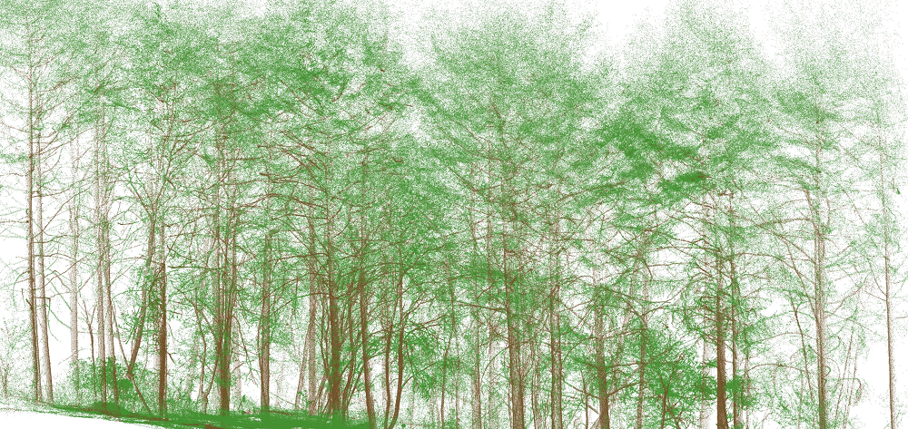
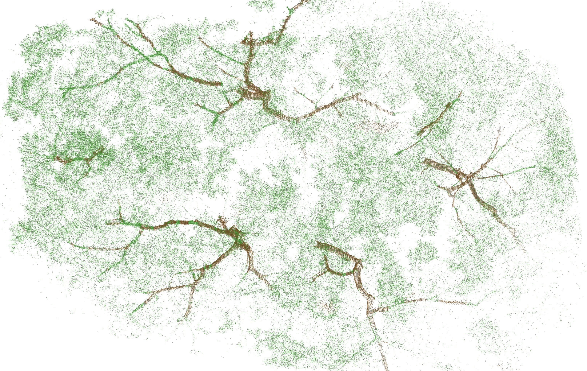
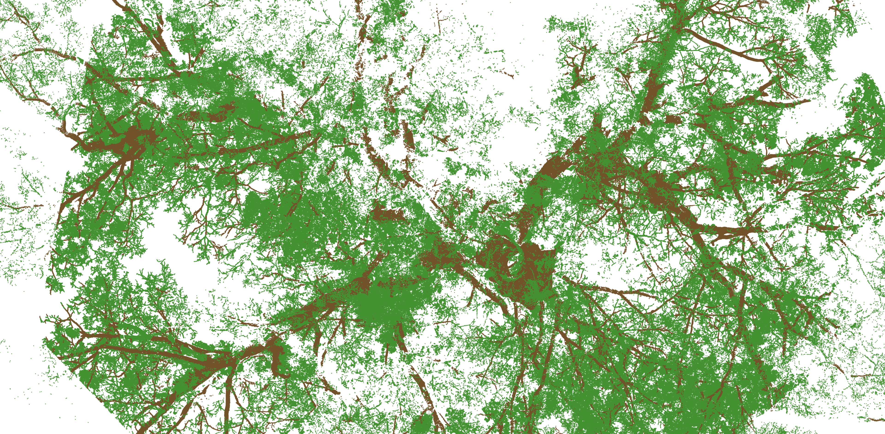

# LeWoS   
  

Unsupervised tree leaf-wood classification from point cloud data   

# Usage  
There are many ways to use this tool.  

**(a) if you have Matlab installed:** 
Option 1. Call the entry level funtion "RecursiveSegmentation_release.m" as:  
“[BiLabel, BiLabel_Regu] = RecursiveSegmentation_release(points, ft_threshold, paral, plot);”  
Inputs:  
% points: this is your nx3 data matrix.  
% ft_threshold: feature threshold. suggest using 0.125 or so   
% paral: if shut down parallel pool after segmentation (1 or other).   
% plot: if plot results in the end (1 or other)  
Outputs:  
% BiLabel: point label without regularization  
% BiLabel_Regu: point label with regularization  

Option 2. Type "LeWoS_RS" in Matlab workspace. This will open up an interface by calling the classdef "LeWoS_RS.m". This classdef file defines the interface.  

Option 3. Drag "LeWoS.mlappinstall" into Matlab workspace. This will install a Matlab App for you.   

**(b) if you don't have Matlab installed, and don't want to install it:** 
Run "LeWoS_installer.exe" for win64. If you need an excutable for other systems (Linux and Mac), please contact me.  (PS: Matlab Runtime 2019b (freely available at https://se.mathworks.com/products/compiler/matlab-runtime.html) is required. You can either install it in advance or do it during the installation of LeWoS.)

-------------------------- 
*Note that if you load an ascii point cloud with the interface, only space delimiter is supported (without header). Currently, these formats are supported: .las; .laz; .mat; .xyz; .txt; .ply; .pcd (recommend to use more generic formats for point clouds, such as las, ply, and pcd)   
*This method does not implement any post-processing filters. Users can design and apply post-processing steps to [potentially] further improve the results.

# Examples

Plot-level separation 

Inside a crown

Very thin branches are difficult to detect

# Acknowledgement
This repo contains code from Loic Landrieu's repo on point-cloud-regularization (https://github.com/loicland/point-cloud-regularization), and Inverse Tampere's repo on TreeQSM (https://github.com/InverseTampere/TreeQSM).

# Bibtex
@article{xxx, 
author = {Wang, Di and Momo Takoudjou, Stéphane and Casella, Eric}, 
title = {LeWoS: A Universal Leaf-wood Classification Method to Facilitate the 3D Modelling of Large Tropical Trees Using Terrestrial LiDAR}, 
journal = {Methods in Ecology and Evolution}, 
volume = {n/a}, 
number = {n/a}, 
pages = {}, 
doi = {10.1111/2041-210X.13342}, 
url = { https://besjournals.onlinelibrary.wiley.com/doi/abs/10.1111/2041-210X.13342 } 
} 
(Current code is a slightly updated version of the one used in publication. With current one, the results are further improved a bit. e.g., 0.925 ± 0.035 vs 0.91 ± 0.03 in the paper.)

# Contact
Di Wang  
di.wang@aalto.fi
